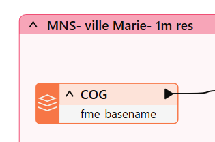
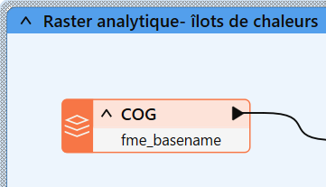
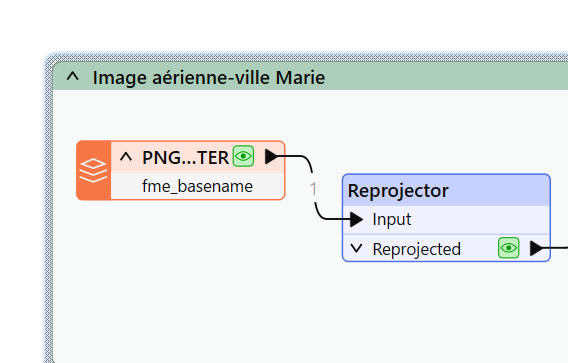
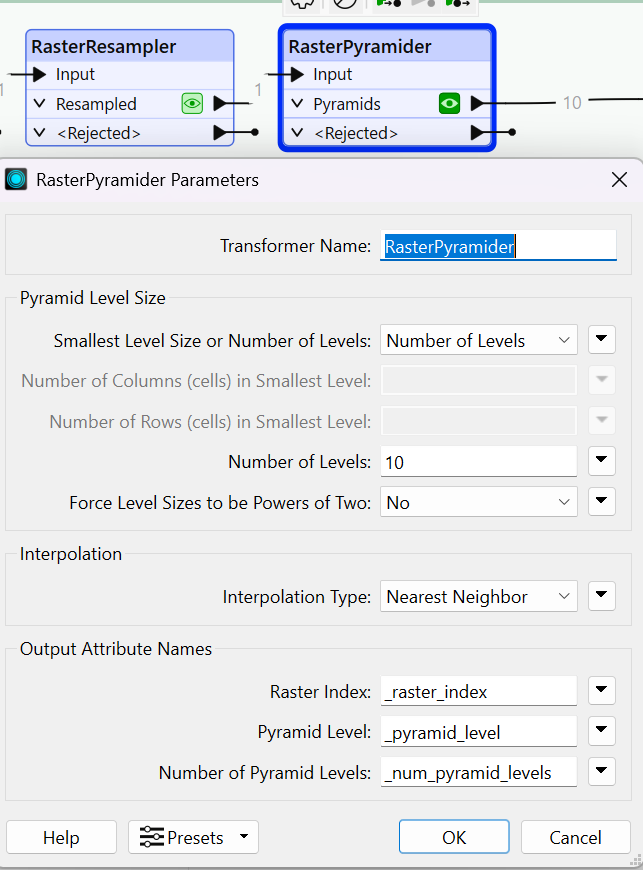
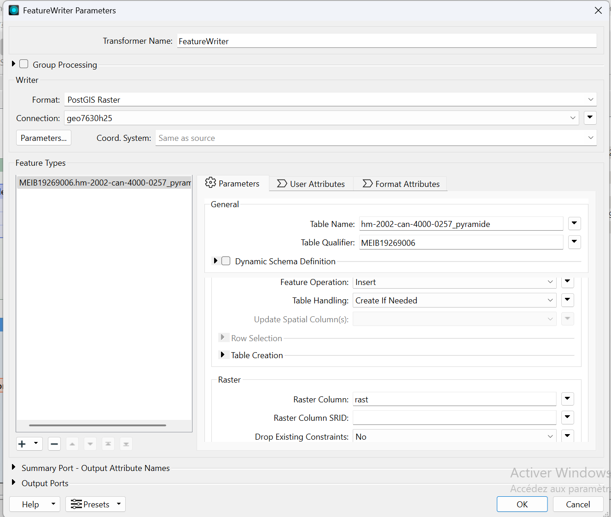

#**LABORATOIRE 4: Intégration Matricielle FME + QGIS**

## Etape initiale: ajout des fichiers et création de readers.

```bash
 
```

```bash
     
```

```bash
_2015_1m_Ville-Marie.tif)  
```
---       

Choisir le `PNG Reader` pour le fichier PNG (image aérienne) et le `COG (cloud-optimized Geo TIFF)` pour les fichiers TIFF ( ilôts de chaleur et modèle numérique de surface). 
Creer un **bookmarks** pour chacun.

 

 




## Partie 1 - Intégration d’image aérienne standard

**Etape 1:** Reprojection du raster en `EPSG:32188`


---

**Etape 2:** Utiliser le `RasterPropertyExtractor` pour extraire des propriétés et des métadonnées d'un raster.


---

**Étape 3:**  utiliser le `RasterResampler` pour redimensionner ou rééchantillonner une image raster, ajustant ainsi sa résolution, sa taille ou sa géométrie.


 
---

**Étape 5:** ajouter le `rasterPyramider` pour optimiser l'affichage et l'analyse de grandes images sur différents niveaux de zoom.


---

**Étape 6:**  on utilise le `FeatureWriter` avec le nom de table: 

```bash
hm-2002-can-4000-0257.
```

 Contrairement au Writer de base celui ci permet de chaîner les actions à la suite de l’écriture.


---

**Étape 7:** dans `SQLExecuter` on exécute la requête suivante:

```bash
CREATE TABLE VOTRECODEMS.mns_pyramid_lvl_2 AS SELECT * FROM "hm-2002-can-4000-0257_pyramide" WHERE "_pyramid_level" = 2
```


Le **workbench** se présente comme suit:


**Etape 8:** visualisation dans QGIS

---

# Partie 2 - Intégration de raster analytique - Ilôts de chaleur

**Etape 1:** Reprojection des îlots de chaleur en `32188`


---

**Étape 2:** ajouter un `RasterToPolygonCoercer` pour convertir des images raster en entités vectorielles polygonales. On change  le `Label Attribute` pour `classification`.


---

**Étape 3:** ajouter un `writer  Postgis` avec pour Nom de la table : `ilots_chaleur_polygones`.


---

**Étape 4:** Visualisation dans QGIS et changer la valeur de la symbologie pour `classification`.


---


---

**Étape 5:** utiliser le `RasterDiffuser` pour améliorer la netteté de l'image raster. Cela permet de rendre l'image plus claire et plus définie.


---

**Étape 6:** ajouter à la suite un `RasterCellValueRounder` avec la valeur **1** dans le champ `Decimal places`. Puis un `RasterToPolygonCoercer` avec pour label `classification`.


---


---

**Étape 7:** ajouter un **writer Postgis** avec pour nom de table ` _ilots_chaleur_polygones_sharp` et ensuite visualisation dans QGIS.


---


---

**Étape 8:** utiliser  `RasterCellCoercer` 


---

**Étape 9:** utiliser ensuite un **writer Postgis** avec le nom de la table `ilots_chaleur_points`. Puis visualisation dans QGIS. Dans symbologie, utiliser **$z** pour extraire la valeur **Z** dans le `constructeur d'expression`.


---


---


---

Le **Workbench** se presente comme suit:


---

# Partie 3: Intégration de raster (MNS)**

**Étape 1:** ajoiuter un `ContourGenerator` pour créer des lignes de contour à partir d'une surface raster.


---

**Étape 2:** ajout d'un `Generalizer` pour simplifier ou lisser la géométrie des entités en réduisant le nombre de sommets. 


---

**Étape 3:** utiliser `AreaBuilder` pour créer des polygones (zones) à partir de lignes ou de points.


---

**Étape 4:** ajout d'un **writer (Postgis)** avec pour nom de table  `mns_contour_polygones`


---

le **Workbench** se présente comme suit:


---

**Étape 5:** effectuer la Visualisation dans QGIS


---


---
---


