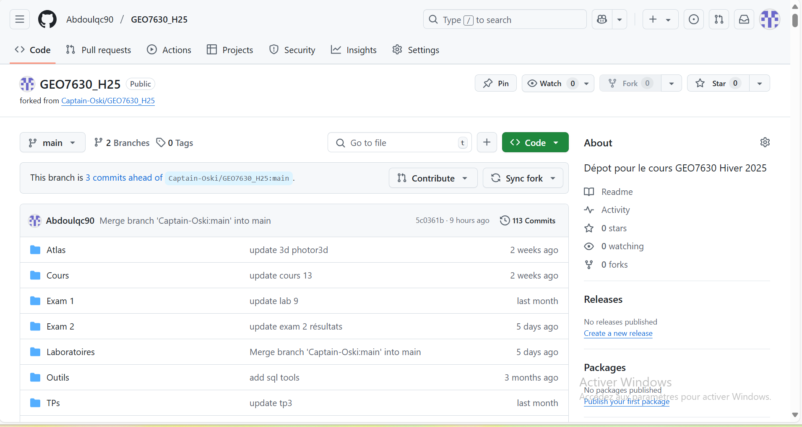
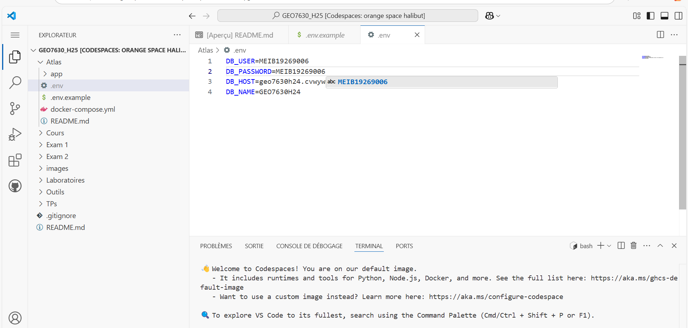
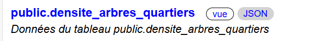

# Laboratoire 10: Configuration Geoserver et mise en place de services VTS et WFS

## Étape 1 : Configuration et lancement d’une instance de Geoserver

**1**. Ouvrir `GitHub` et Lancer un Codespace à partir de notre fork du dépot github du cours (sur la branche main le codespace).

---

---

---


---


---

## Étape 2 : Configuration de l’environnement

**1**.Dans le dossier `Atlas`, on Copie-colle le fichier  `.env.example` situé dans le dossier Atlas (dans le même dossier) puis on renomme le fichier en `.env` (supprimer le .example).
 Ensuite, on va modifier les variables d’environnement avec nos informations personnelles :
 ```bash
DB_USER=MEIB19269006
DB_PASSWORD=MEIB19269006
DB_HOST=geo7630h25.cvwywmuc8u6v.us-east-1.rds.amazonaws.com
DB_NAME=geo7630
```
---

---

**2**.Dans le dossier Atlas,  on fait un clic droit sur le fichier `docker-compose.yml` et on sélectionne `Compose Up`. 
Dans notre cas, on va installer tout dabord `Docker` avant de faire `compose up`
---

---

---

---

Ensuite on va ouvrir un terminal (CTRL+J) et testez l’application en accédant à son interface web.

---

---

## Étape 3 : Ajout de contrôles de carte

Dans `/Atlas/app/app.js`, on va ajouter les contrôles suivants :

**Contrôle de navigation** : 
```bash
var nav = new maplibregl.NavigationControl({
    showCompass: true,
    showZoom: true,
    visualizePitch: true
});
map.addControl(nav, 'top-right');
```

**Contrôle de géolocalisation** :
```bash
var geolocateControl = new maplibregl.GeolocateControl({
    positionOptions: { enableHighAccuracy: true },
    trackUserLocation: true
});
map.addControl(geolocateControl, 'bottom-right');
```

**Contrôle d’échelle** :
```bash
var scale = new maplibregl.ScaleControl({ unit: 'metric' });
map.addControl(scale);
```

On Recharge ensuite la page pour voir les contrôleurs s’afficher.

---

---

## Étape 4 : Chargement de données depuis un serveur de tuiles vectorielles

**1** On recherche le service de tuiles vectorielles correspondant à notre couche dans l’interface d’administration du serveur de tuiles (par exemple pg_tileserv). On ouvre dans un navigateur l'`adresse tranférée` du `port 8801` tout en s'assurant que la visbilité est `public`.

---

---

Ensuite, sur la page `pg-tileserv`  on cherche l'URL `public.densité_arbres_quartiers` en bas de la page,

---

---

On clique ensuite sur `JSON` et on coche la case `impression automatique`

---

---

On repére l'url en bas de la page puis on le copie et colle dans notre script. Dans notre cas, l'URL se présente comme suit :
```bash
"https://super-duper-carnival-5grrgx7r76gwc7vrj-8801.app.github.dev/public.densite_arbres_quartiers/{z}/{x}/{y}.pbf"
```

---

---

---

---

**2** Ajout de la méthode `map.onLoad()` dans app.js 

```bash
map.on('load', function () {
    map.addSource('qt_arbres_quartier_source', {
        type: 'vector',
        tiles: ['https://special-train-gv4r9g5gj4cvp7-8801.app.github.dev/public.densite_arbres_quartiers/{z}/{x}/{y}.pbf']
    });
    map.addLayer({
        'id': 'qt_arbres_quartier',
        'type': 'fill',
        'source': 'qt_arbres_quartier_source',
        'source-layer': 'public.densite_arbres_quartiers'
    });
});
```

---

---

**3**  Recharger la carte pour voir les données s'afficher.

---

---

On peut toujours Ouvrir la console du navigateur `(F12 > Console)` pour vérifier s’il y a des erreurs.

## Étape 5 : Stylisation

Ajoutez une propriété paint pour modifier le rendu
```bash
'paint': {
    'fill-color': '#FF0000',
    'fill-opacity': 0.5
}
```
Attention les propriétés du layer sont séparées par des virgules.

---

---

On recharge la carte ensuite

---

---

## Étape 6 : Style avancé

On va appliquer un style basé sur une interpolation linéaire de la propriété `qt_arbres`:
```bash
'paint': {
    'fill-color': [
        'interpolate',
        ['linear'],
        ['get', 'qt_arbres'],
        0, 'rgb(255, 255, 255)',
        100, 'rgba(192, 192, 255, 0.64)',
        1000, 'rgba(46, 46, 255, 0.58)',
        5000, 'rgba(68, 0, 255, 0.66)',
        7000, 'rgba(19, 0, 70, 0.66)'
    ],
    'fill-opacity': 0.7
}
```

---

---

---

---

## Étape 7 : Ajout d’une couche WFS

On utilise FME pour charger les limites d'arrondissements dans notre schéma de bases de données (nommer la table aussi simplement que arrondissements)
Ensuite, on va rendre le port `9000 (pg_featureserv)` `public` pour trouver et copier l'URL du service WFS des arrondissements.

---

---


