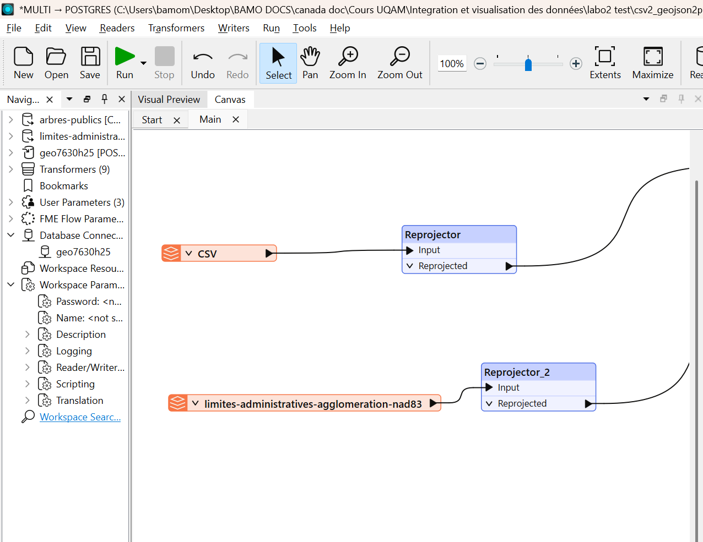
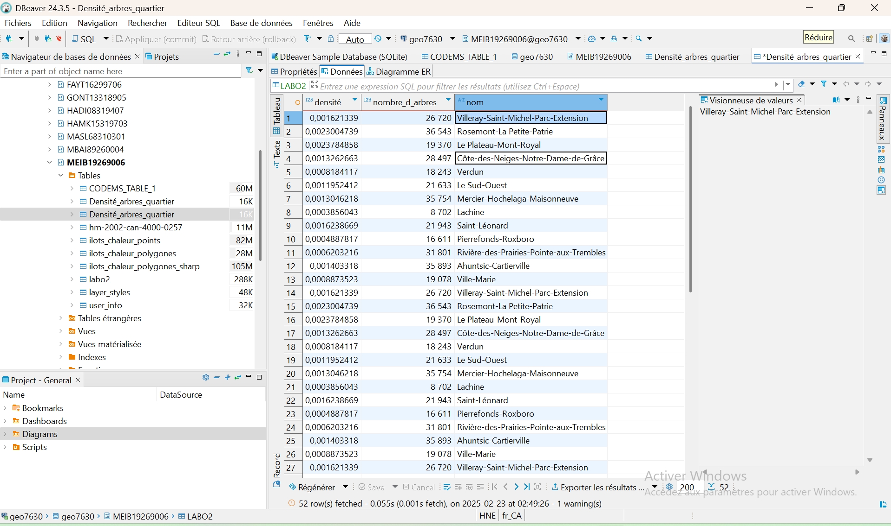
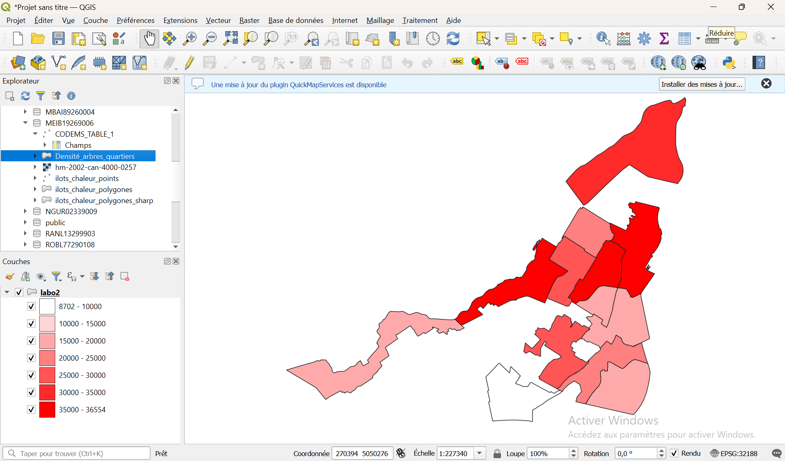

# GEO 7630 - Laboratoire 2 : Jointure et traitement des données géospatiales.

## Problématique : Identifier la répartition des arbres par quartier dans la ville de Montréal.

---

# Étape 1: lecture des données sources dans FME.

- Ouvrir **FME WORKBENCH** et créer un `nouveau projet`.

- On ajoute un `Reader` au format **CSV** pour les données des arbres, puis dans `dataset`, on copie et colle le lien suivant:

```bash
https://donnees.montreal.ca/dataset/b89fd27d-4b49-461b-8e54-fa2b34a628c4/resource/64e28fe6-ef37-437a-972d-d1d3f1f7d891/download/arbres-publics.csv
```
On ajoute ensuite un autre `Reader` au format **GeoJSON** pour les données des quartiers, puis on copie et colle le lien suivant dans `dataset`:

```bash
https://donnees.montreal.ca/dataset/9797a946-9da8-41ec-8815-f6b276dec7e9/resource/6b313375-d9bc-4dc3-af8e-ceae3762ae6e/download/limites-administratives-agglomeration-nad83.geojson
```

---
- Inspecter les données à l'aide de **Feature catching**, tout en s'assurant que les géométries sont valides et que les attributs sont chargés correctement.

---

# Étape 2: Reprojection des données.

- Dans ``Transformers`, on utilise `Reprojector`pour projeter les jeux de données en **EPSG:32188 MTM8**.



---

# Étape 3: Jointure spatiale.

- Dans `Transformers`, on utilise la fonction `PointOnAreaOverlayer` pour associer chaque point (arbre) à un polygone (quartier).

- **Nettoyage des attributs**: à l'aide de la fonction `AttributeManager`, on va  filtrer les colonnes inutiles et garder uniquement les attributs pertinents tels que `nom_quartier` et `nombres_arbres`.

---

# Étape 4: Calcul d'une statistique supplémentaire.

- on crée un champ `densite_arbres` à l'aide de la fonction `AttributeCreator`, puis dans `Arithmétic Editor - Value` on entre la formule suivante:

```bash
@Value(nombre d'arbres)/@Area()
```
---

# Étape 5: Écrire les données dans PostgreSQL.

- Exporter le résultat dans la base de données à l'aide d'un **Writer PostgreSQL**.

- On nomme la table `densite_arbres_quartiers`. 

- Dans les paramètres, le **mode d'écriture** est `Drop and Create`, le **spatial type** est `Geometry` et le **table qualifier** est  `MEIB19269006`.

---

# Étape 6: Vérification de la table dans DBeaver.

- Ouvrir DBeaver puis verifier que la table est bien présente et que les attributs sont correctes.



# Étape 7: Visualiser les données dans QGIS

- Dans **QGIS**, on se connecte à la base de données `PostgreSQL` puis on charge la table `densite_arbres_quartiers`.

- On applique un `gradient de couleurs` pour représenter la densité d'arbres.

- On enregistre le style en tant que `fichier de style de couche QGIS`.

- La carte finale observée est simple et compréhensible.




