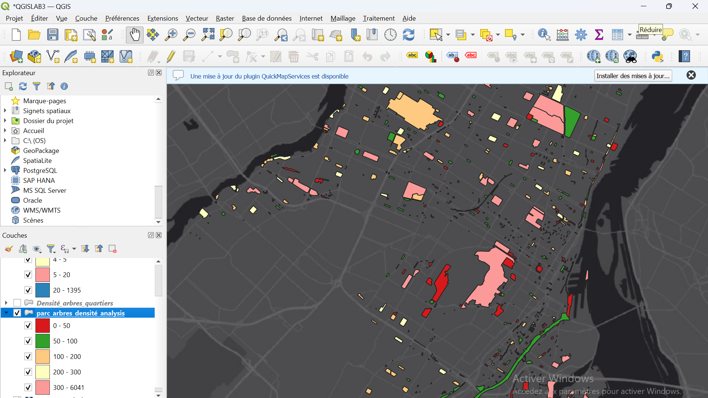

# Laboratoire 3 : Optimisation de la densité d’implantation d’arbres dans les parcs de Montréal (problématique fictive).

## Problématique: Optimiser la densité d’implantation d’arbres dans les parcs de Montréal.
---
# Étape 1 : Acquisition des données.

- Aller sur: 
https://donnees.montreal.ca/ pour acquerir les données suivantes:

- **Arbres (points)** en format **CSV**:
```bash
https://donnees.montreal.ca/dataset/63ca34cd-d636-420c-929b-cac47116f2e5/resource/d99f8ff2-55ae-4581-920e-146219c5f429/download/arbres-abattages.csv
```

- **Parcs (polygones)** en format **GeoJSON**:
```bash
https://donnees.montreal.ca/dataset/2e9e4d2f-173a-4c3d-a5e3-565d79baa27d/resource/35796624-15df-4503-a569-797665f8768e/download/espace_vert.json
```
---

# Étape 2 : Chargement des données dans FME.

- Dans  **FME Workbench**, on crée un nouveau projet, puis on ajoute un `Reader CSV` pour les données des arbres et  un `Reader GeoJSON` pour les données des parcs.

---

# Étape 3 : Reprojection des données.

- On utilise  un  `Reprojector` pour reprojeter les couches de données (arbres et parcs) en **EPSG:32188**.


---

# Étape 4 : Jointure spatiale.

- On associe chaque arbre à un parc gràce au transformer `PointOnAreaOverlayer`.


---


---

# Étape 6 : Nettoyage et validation des données**

- On utilise un **AttributeManager** ou un **AttributeKeeper** pour conserver uniquement les champs essentiels. Dans **AttributeManager**, on va renommer l'attribut `point_count` en `nombre_arbres` dans le **Output Attribute**.


---

- On utilise également un **AttributeFilter** pour filtrer les champs **Null** ou égal à **0**.


---


---

- On connecte un **Logger** aux "features rejetées" :


---

# Étape 7 : Calcul de la médiane de densité.

- Avant de calculer la médiane de densité, on va tout dabord créer un attribut **densité_arbres** dans **AttributeCreator**.


---

---

- A l'aide de **StatisticsCalculator**, on calcule la médiane pour les variables `nombre_arbres` et `densité_arbres`.


---

# Étape 8 : Calcul de l’index par rapport à la moyenne.

- Dans **AttributeManager**, on va définir un nouvel attribut: `parc_arbres_densité_index`.


---


---

# Étape 9 : Nettoyage des données.

- A l'aide du **NullAttributeManager**, on remplacer les attributs vides ou contenant des caractères spéciaux par **NULL** 


---

# Étape 10 : Exportation des résultats.

- A l'aide d'un **Writer**, on exporte les résultats dans une base de données centralisée (PostGIS).
---

# Étape 11 : Visualisation des résultats

- Ouvrir **QGIS** pour visualiser nos resultats. On applique un style à la carte pour faciliter la compréhension et aussi un fond de carte **ESRI Gray (dark)**.


---

# Étape 12: Analyse de la densité arboricole avec une grille H3

**1) Création d’une grille hexagonale**

- On établi une connection entre les données des parcs et **H3HexagonalIndexer**.


---

**2) Dissolution des indexes H3**

- On ajoute un **Dissolver** pour regrouper tous les hexagones ayant le même `H3Index` en un seul.


---

**3) Reprojection des données**

- On utilise le transformer **ESRIReprojector** pour reprojeter les couches de données (arbres et parcs) en **EPSG:32188**. 

**4)  Calcul des arbres par hexagone**

- On compte les arbres par hexagone grâce au transformer **PointOnAreaOverlayer** puis on utilise un **Dissolver** pour simplifier les données.


---

**5) Sélection des attributs désirés**

- On ajoute **AttributeKeeper** pour conserver que les attributs suivants: **point_count**, **geometry**, et **h3index**.

**6) Renommer les champs pour l’exportation**

- Utiliser **AttributeManager** pour renommer les champs sélectionnés avec des noms explicites.


**7)  Exportation dans PostGIS**

- On va sauvegarder les données dans `PostGIS` à l'aide d'un **Writer**.

**8) Visualiser et styliser la grille hexagonale**

- On charge la couche hexagonale dans **QGIS** tout en appliquant un style approprié pour représenter les valeurs clés tel que `nombre_arbres`, afin de faciliter la compréhension et l'interpretation de la carte.


