#**Laboratoire 5: Intégration et visualisation de données 3D Lidar et tuiles 3D Vectorielles**

## Étape 1 Importation et nettoyage des nuages de points.

Utiliser un `LAS READER` pour l'ajout de 6 nuages de points puis ajouter un `Thinner` avec un filtre de 30 pour chaque reader. Pour combiner les 6 nuages de points en 1 seul, on ajoute un `pointcloudcombiner` et un `EsriReprojector` (2950 to 3857)pour reprojeter les points.
----

```bash
http://depot.ville.montreal.qc.ca/geomatique/lidar_aerien/2015/301-5041_2015.laz
```

```bash
http://depot.ville.montreal.qc.ca/geomatique/lidar_aerien/2015/301-5040_2015.laz
```

```bash
http://depot.ville.montreal.qc.ca/geomatique/lidar_aerien/2015/301-5039_2015.laz
```

```bash
http://depot.ville.montreal.qc.ca/geomatique/lidar_aerien/2015/300-5041_2015.laz
```

```bash
http://depot.ville.montreal.qc.ca/geomatique/lidar_aerien/2015/300-5040_2015.laz
```

```bash
http://depot.ville.montreal.qc.ca/geomatique/lidar_aerien/2015/300-5039_2015.laz
```
----


---

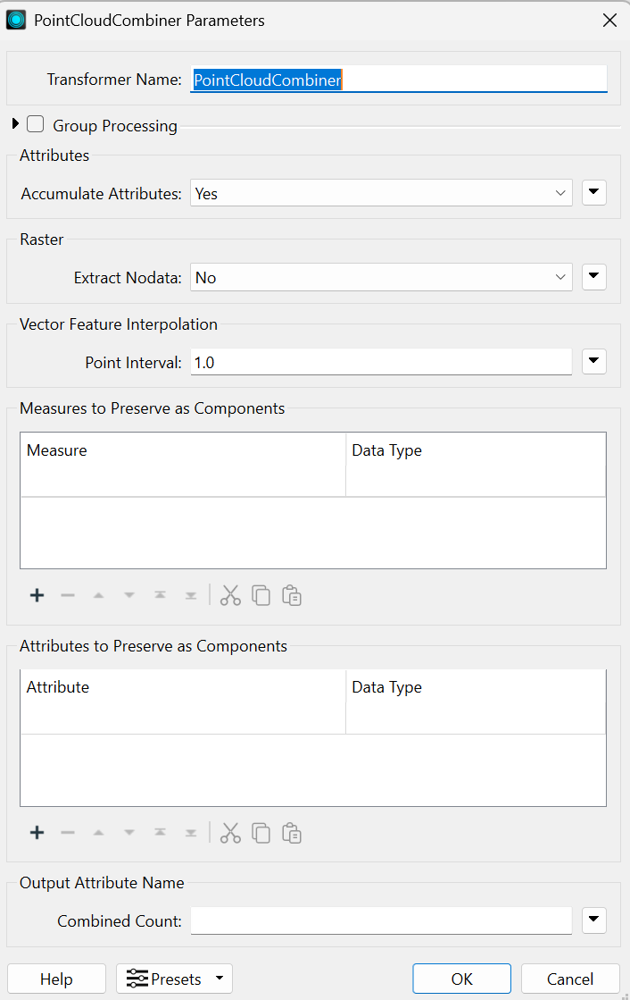

---


---
La prémière étape se présente comme suit: 
----
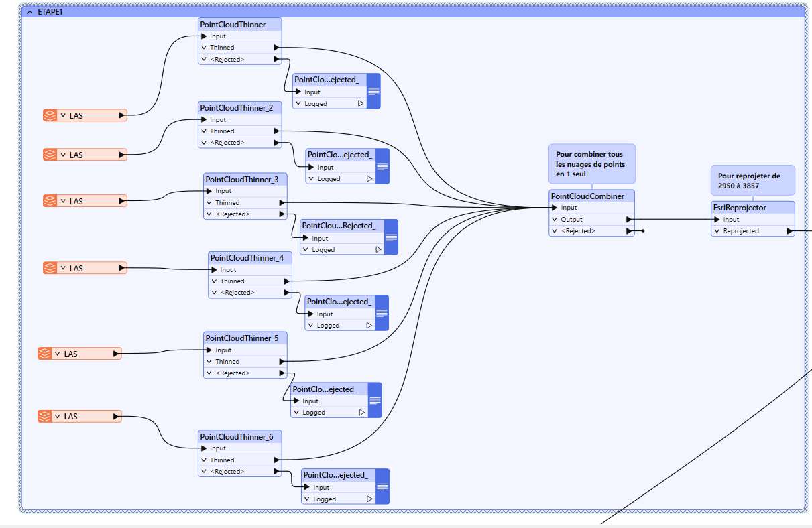

-----
## Étape 2: Importation des limites terrestres et découpage du nuage de points.
---
**1** Ajout d'un `GeoJSONReader` (URL) puis un `Reprojector` 4326 vers 3857 

```bash
https://data.montreal.ca/dataset/b628f1da-9dc3-4bb1-9875-1470f891afb1/resource/92cb062a-11be-4222-9ea5-867e7e64c5ff/download/limites-terrestres.geojson
```
-----


----

**2** On utilises un `Clipper` pour découper le nuage de points puis avec les limites terrestres pour enlever les points superflus qui dépasse de notre zone de travail

----

----
**3** On connecte ensuite le nuage de points combiné dans l'étape 1 aux limites terrestres clippées.
----
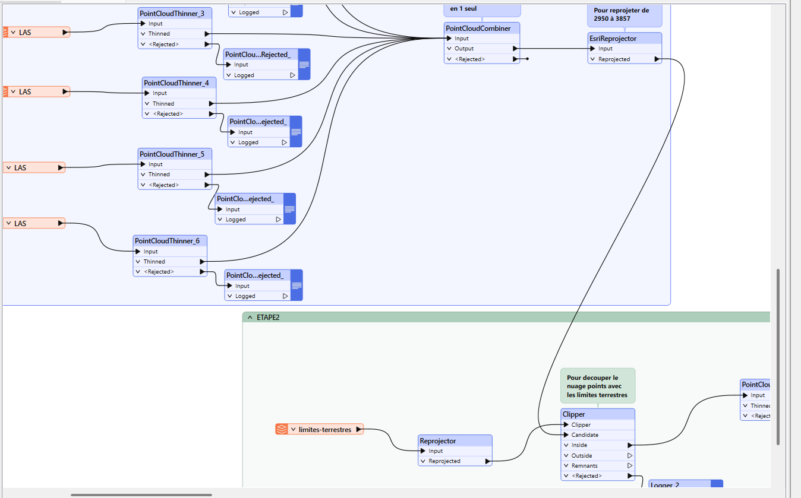
----

## Étape 3: Simplification du nuage de points avec un  thinner interval de 5 

----

---
## Étape 4: Ajout de rasters géoréférencés

**Objectif**: ajouter la couleur du raster à notre nuage de points

**1** On telecharge et on ajoute les 4 rasters d'un seul coup en faisant un `drag and drop` dans un `PNG Reader`.
---

---

**2** Ajouter un `reprojector` 3857 vers 32188 puis un `rasterMosaicker` dans le but de fusionner les rasters en seul. Pour choisir les 3 bandes RGB et supprimer la bande alpha, on ajoute un `RasterSelector`.


----

---


----

---

On peut décider d'ajouter `rasterPropertyExtractor` et ensuite coller un `listExploder` sur la propriété BAND dans le but de connaître sur quelle bande se situe quelle couleur.

---
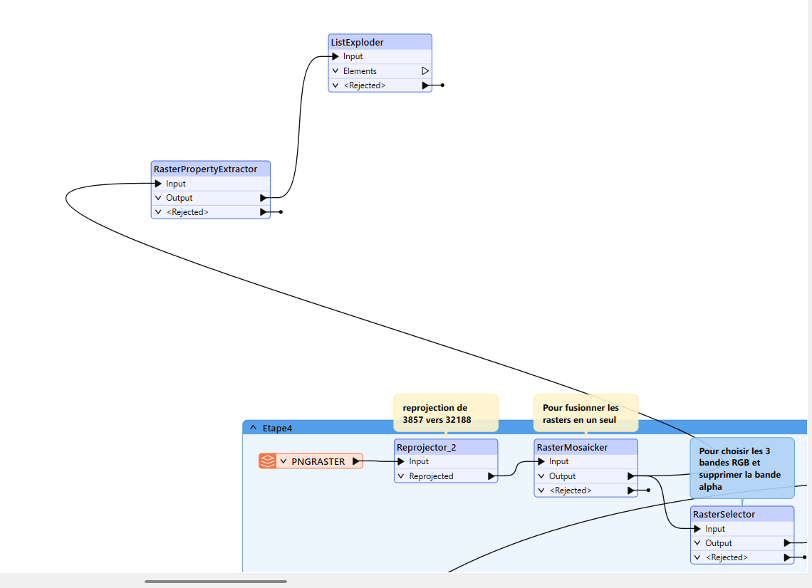
---

**3** On ajoute  `EsriReprojector` (2950 à 3857) 

## Étape 5:  Jointure raster et nuage de points

**1** Ajouter la couleur dans votre nuage de point en ajoutant les valeur du raster avec un `PointCloudOnRasterComponentSetter` puis combiner le résultat en 1 seul nuage avec un `PointCloudCombiner`. 

---
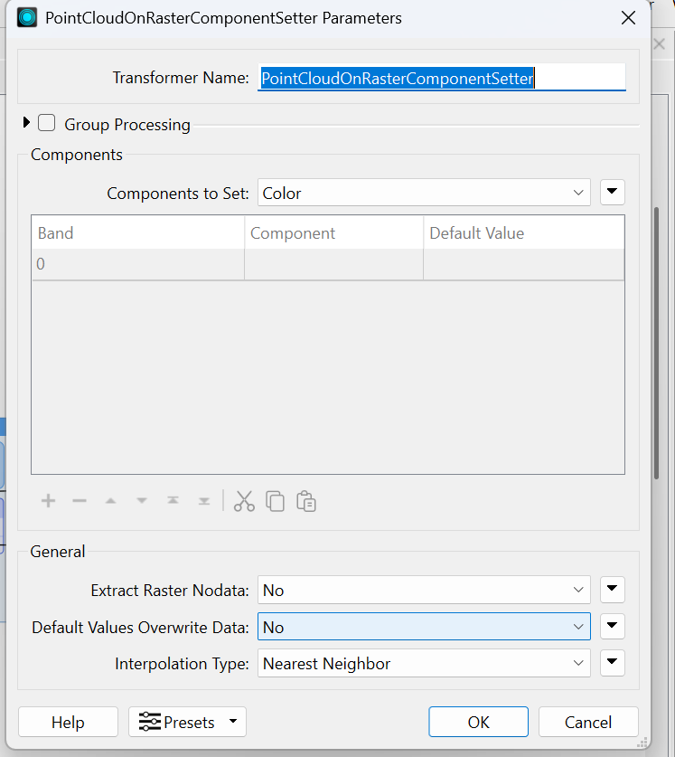
---

---
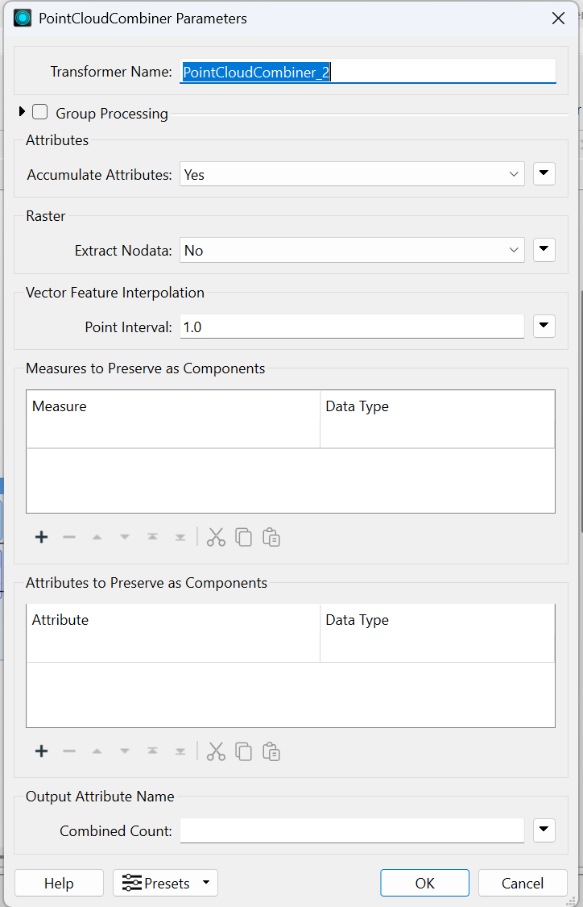
---

**2** Filtrer les valeurs du nuage de points dont le raster n’a pas donné de valeur avec un `pointCloudFilter`. Pour ce faire, on va choisir les valeurs RGB qui sont toutes à 0 avec l’expression suivante :
```bash
@Component(color_red)!=0&&@Component(color_blue)!=0&&@Component(color_green) 
```

Puis pour terminer nous allons transformer le nuage de points en couche de vecteurs ponctuels simple avec un `PointCloudtopointCoercer`, en s’assurant de garder les composantes nécessaires pour la suite.
---

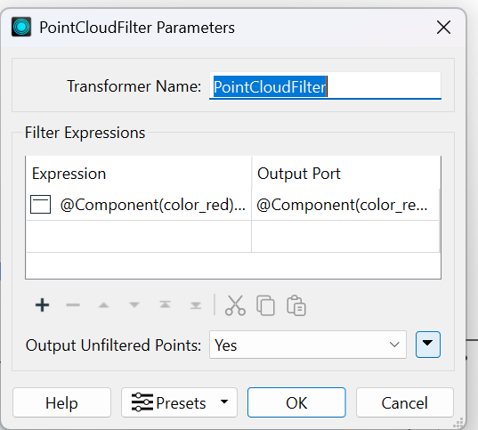
---


---

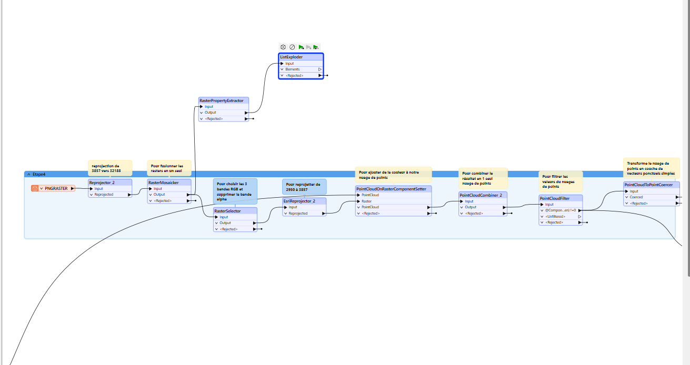
---

## Étape 6: Ajout des empruntes et details de bâtiments

**Objectif**:  assigner le Z et la couleur aux polygones de bâtiments

**1** Ajouter 2 sources shapefiles pour les empreintes de toits  (polygones) et les détails des toits (lignes) puis Reprojeter 2950 en 3857 avec un `EsriReprojector`.

----

----
**2** On Calcule le bounding box du nuage de points avec un `BoundingBoxAccumulator`puis on découpe avec un `Clipper` les polygones et les lignes. On découpe également les empreintes de toits avec les détails à l'aide d'un `PolygonCutter` issue du FMEHub.
---

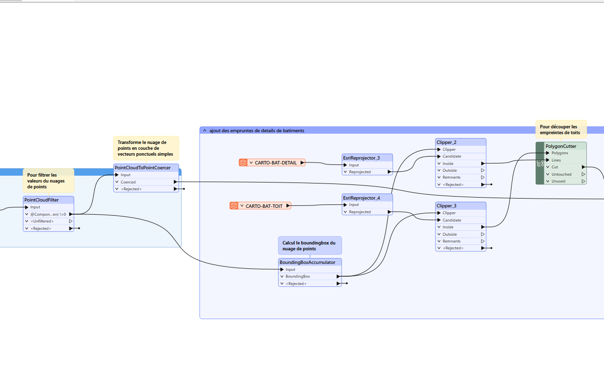

---

## Étape 7: Jointure des propriétés du nuage de points dans les polygones

**1** On joint les polygones détaillés avec les points du nuages de points pour y injecter les valeurs de Z et de couleur du batiments avec un `PointOnAreaOverlayer`. On va accumuler les informations de Z et de couleurs pour ensuite calculer les moyennes qui nous permettront d’attribuer à chaque “bâtiments” une hauteur moyenne et une couleur.

---
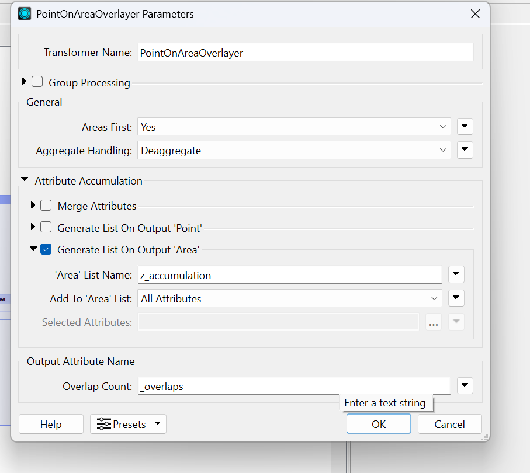
---

**2** On ajoute un `ListSummer` puis on va créer un attribut pour calculer la moyenne avec`AttributeCreator`.
**Valeur d'attribut**:
```bash
 @Evaluate(@round(@Value(_sum)/@Value(_overlaps),4))
 ```
 ---
 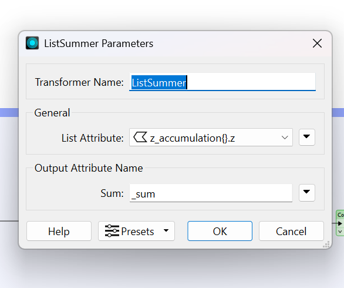
---

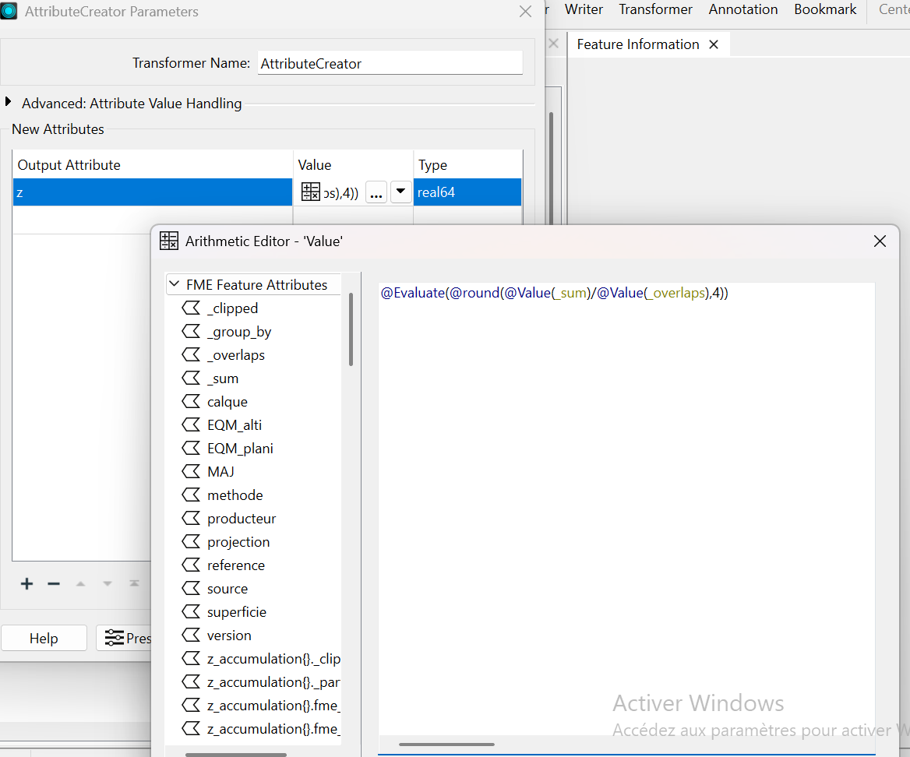
---

**3** `AttributeManager` pour garder seulement les 2 propriétés qui nous intéressent et ensuite on transforme le `FME color` en RGB ou WebRGB  avec un `ColorConverter` (FME Hub). On exporte par la suite notre résultat avec `GeoJSONWriter` dans le répertoire : 
```bash
"C:\Users\bamom\Desktop\BAMO DOCS\canada doc\Cours UQAM\Integration et visualisation des données\labo5\labo5.json"
```
---
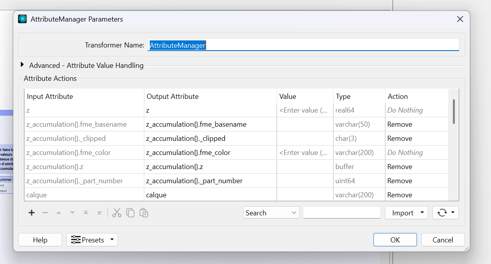
---

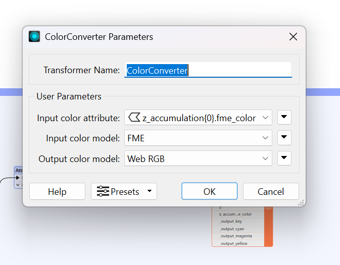
---

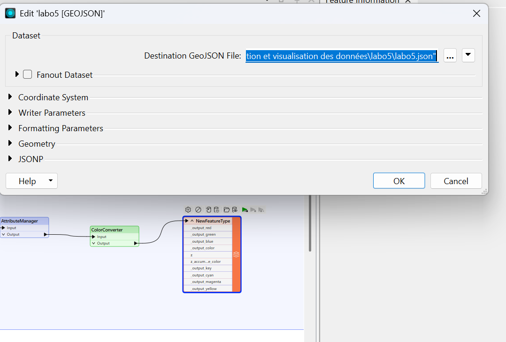
---
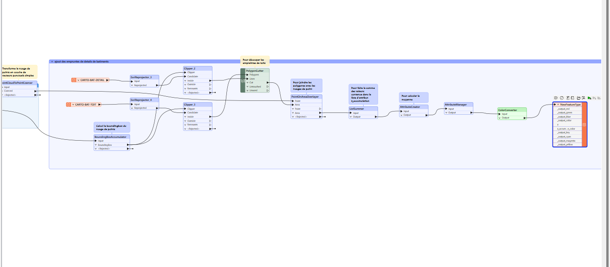
---

## Étape 9 Visualisation du résultat dans MaplibreGL

On ouvre le fichier `MaplibreGL.html` en double cliquant dessus puis dans `choisir un fichier`, on sélectionne notre fichier: 
```bash
"C:\Users\bamom\Desktop\BAMO DOCS\canada doc\Cours UQAM\Integration et visualisation des données\labo5\labo5.json"
```
cela va nous permettre de naviguer et visualiser notre carte avec les bâtiments.

----


