## Laboratoire 6 et 7 : ArcGIS Online, Dashboard et Experience Builder – Intégration de données

## Étape 1: Importation des données dans ArcGIS Online**

**1** Chargement des données CSV:
```bash
https://sitewebbixi.s3.amazonaws.com/uploads/docs/20220107-donnees-ouvertes-8aa623.zip
```
**2** Filtrage des attributs avec `AttributeFilter`tout en excluant les entités n’ayant pas de longitude. On ajoute **-1** pour filtrer les stations qui ont des mauvaises coordonnées ou des coordonnées éronnées. 

---
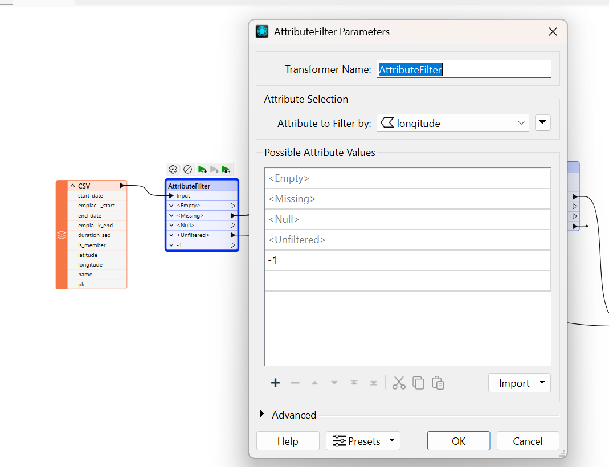
---

**3** Calcul des statistiques avec `StatisticsCalculator` pour calculer les arrivées et départs par station. On ajoute un `StatisticsCalculator` sur le champ *emplacement_pk_end* sur le port *Missing de sortie* puis grouper les données pour obtenir le total des arrivées par station.
---
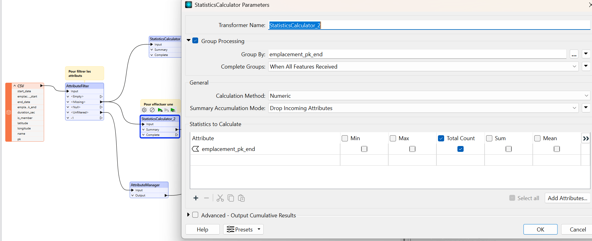
---
On repète le même processus pour les départs (*emplacement_pk_start*).
---
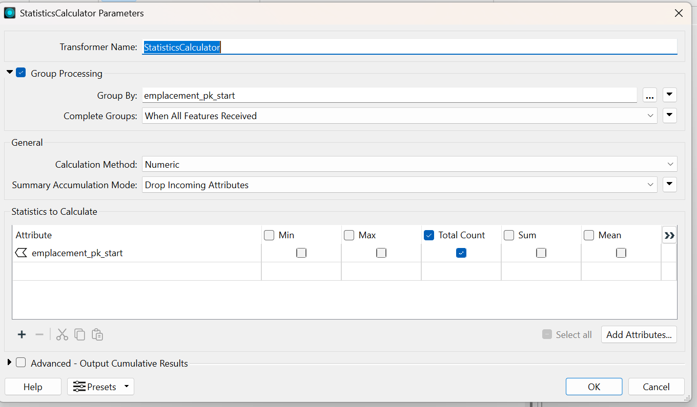
---
**4**  Nettoyage et gestion des attributs (*AttributeManager*) pour les stations de Bixi.
Utiliser `AttributeManager` pour Conserver uniquement les attributs nécessaires et garantir la cohérence des noms de champs. Ensuite, renommer les champs pour faciliter l’intégration dans ArcGIS Online (AGOL).
---

---


---
**5**  Jointure des données avec `FeatureJoiner`

On ajoute un `FeatureJoiner` pour relier les stations aux données de départ par stations et ensuite on configure la clé de jointure sur l’identifiant unique des stations (*PK pour Primary Key*). 
---
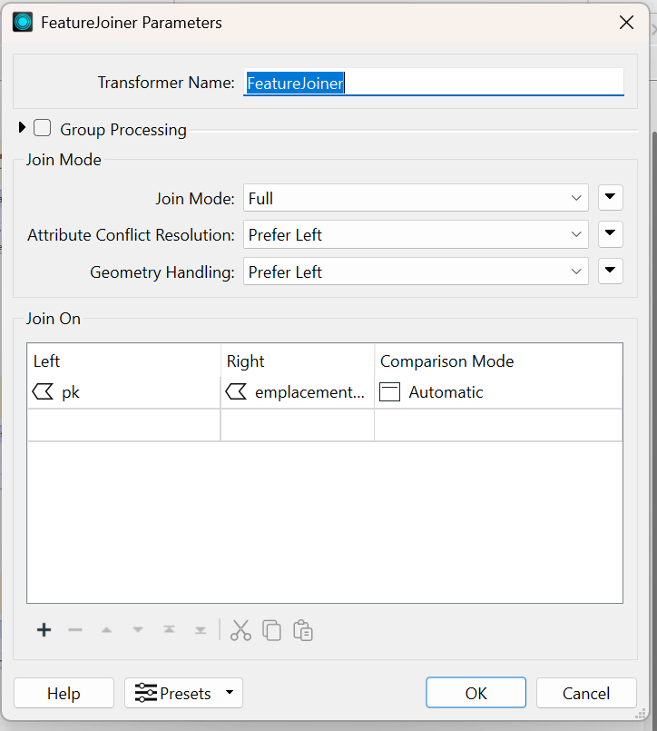
---

Ajouter ensuite un autre `FeatureJoiner` enchaîné sur le port de sortie *"Joined"* pour joindre les sommes des arrivées par stations. Il est important d'ajouter un `logger` pour s'assurer que tout fonctionne bien. On ajoute par la suite un `AttributeManager` pour faire le ménage et renommer les attributs 
---
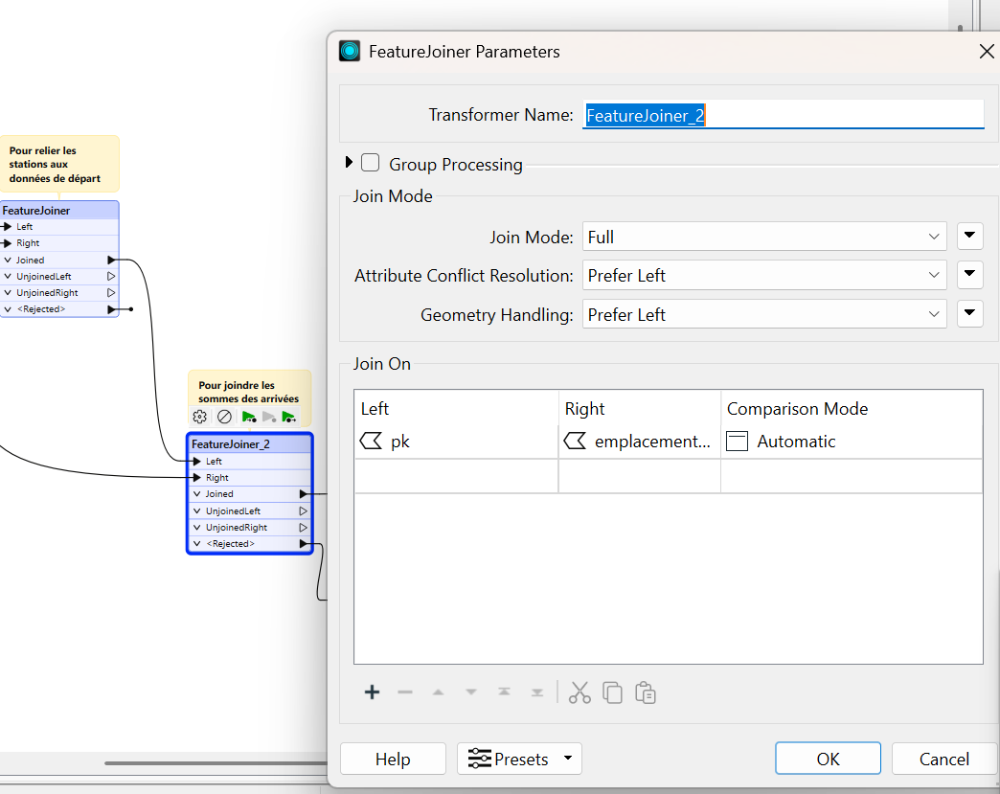
---
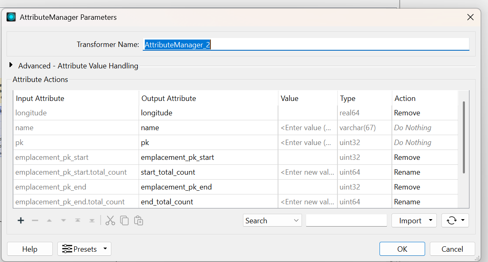
---

Cette étape se résume comme suit: 
---
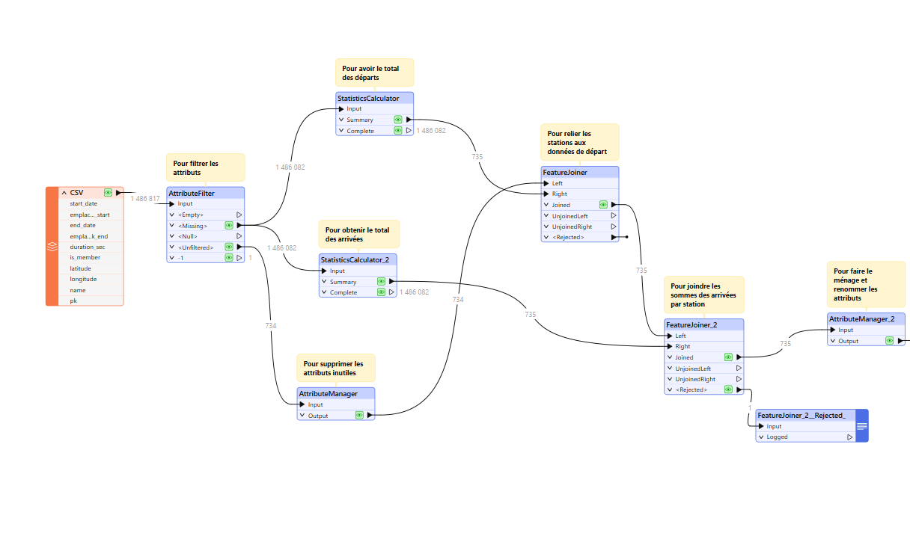
---

## Étape 2 : Exportation des données vers ArcGIS Online

**1** Accéder à ArcGIS Online et créer un dossier GEO7630 à travers le lien suivant:
```bash
https://uqam.maps.arcgis.com/home/index.html
```
---

---
**2** Connecter FME à `AGOL Writer` puis Créer un nouveau Feature Service dans le dossier "Geo7630" précédemment crée. On active `CREATE IF NEEDED` pour la mise à jour automatique.
---

---


---


---

**3** Visualisation et exploitation des données dans ArcGIS Online
On va dans la page `contenu` cliquer sur notre Nouveau `FeatureLayer` puis sur `Ouvrir dans MapViewer`
---

---

## Étape 3 : Création d’une carte interactive (MapViewer)

**1** On ouvre le Feature Layer dans MapViewer et on applique un `style d’agrégation` pour représenter les départs et arrivées. Ensuite on va configurer les étiquettes pour afficher les `totaux par station`.
---

---
**2** On clique maintenant sur `Styles` puis sur `+ Champ` afin d’ajouter `start_total_count` et `end_total_count`. On Choisit `Comparer A à B`.
---

---
**3** Cliquer sur `Options de style` puis on choisit dans l’onglet `Étiquettes` l'option `Afficher A comme pourcentage de A et B`. Après on enregistre en tant que `CARTE 1`.
---

---

---
**4** On  clique sur le menu d’applications et on choisit `Dashboards`
---
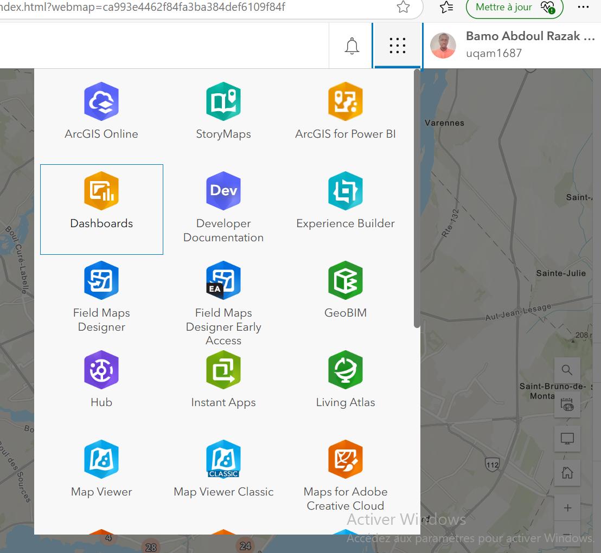 
---

## ÉTAPE 4:  ESRI Dashboard

**1** On crée un nouveau tableau de bord et on choisit le bon dossier puis on ajoute un élément `CARTE `. On choisit la carte précédemment crée avec les clusters puis dans `réglages`, on selectionne les options selon nos choix avant de cliquer sur `terminé`.
Pour notre cas, on a volontairement laissé les paramètres par défaut avant de cliquer sur `terminé`.

---

---

---

---

---

**2** Dans `Mise en page` (Version), on ajoute un `en-tête`( `abdoulTest` par exemple)
---

---


---

**3** Dans `CORPS`, on va ajouter un élément en de type `JAUGE`, avec la somme statistique sur le `start_total_count`.
---
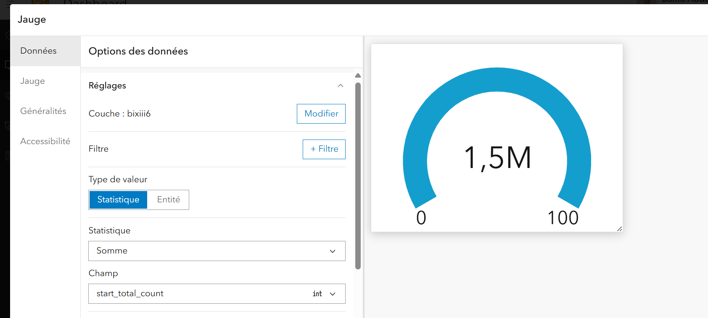
--

**4** Dans généralité, on change le Titre (`Total des départs`) puis on  enregistre. Ensuite on glisse la jauge en bas de la carte. On repète le même processus pour la somme statistique `end_total_count`.
---

---

**5** Ajout d'un indicateur

Dans `INDICATEUR`, on clique sur `ACTIVER (mise en forme avancée)`
---
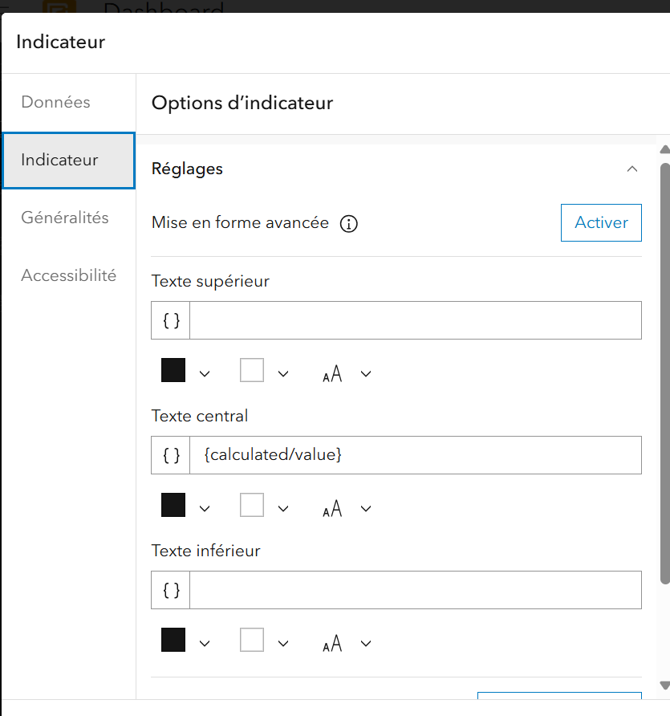
--- 

Puis on ajoute les lignes suivantes à `TOPTEXT`:
```bash
topText: 'Ratio départ / arrivée',
```
```bash
topTextMaxSize: 'medium',
```
```bash
  middleText: Round($datapoint.SUM_START_TOTAL_COUNT/$reference.SUM_END_TOTAL_COUNT,3),
```

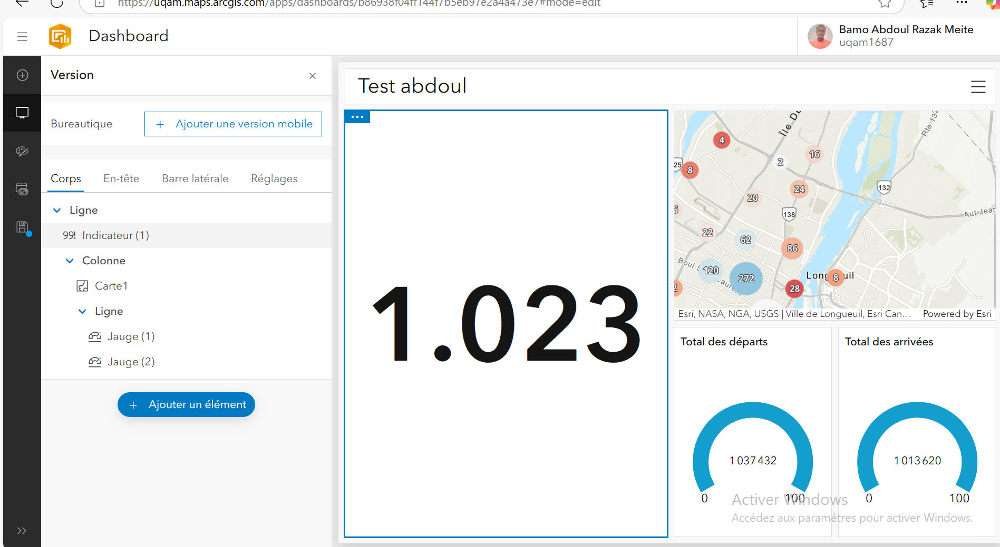

---

**6** Ajout d'un nouvel indicateur sur le total de station à l’écran (nombre de station) et d'une légende.
---

---

**7**  on va activer le calcul dynamique sur chacun des widgets

On Clique sur Configurer la carte puis on va  dans `ACTIONS SUR LA CART`E et` activer toutes valeurs de filtre`.
---

---

Notre carte devrait ressembler à ca: 
---

---

## Étape 5: ESRI Experience Builder

**1** Ouvrir `Expérience Builder` et Créer un nouveau Experience Builder. On Choisit un template “Grille vierge”
On va ensuite ajouter une carte 

---

---

**2** Cliquer sur `selectionner des données` à droite puis on choisit la bonne carte et on clique sur terminé.

---

---

---

---

**3** Insérer la légende en drag and drop puis   des des Geosignets
---

---

---
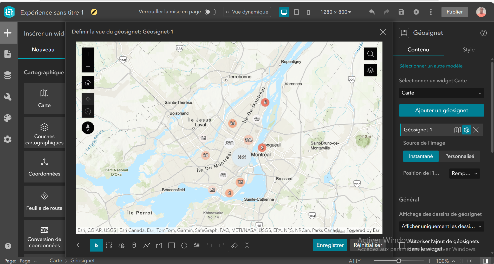
---

**4**  ajout d'une TABLE et 2 éléments de texte puis Ajouter au texte une connexion aux données 


rendu après ajout de table et deux éléments de texte: 
---

---

**5** Injecter des données statistiques dynamique au texte:

Cliquer sur le texte et sur l’icône Base de données au dessus de la boîte de texte puis Ajouter la somme par départ et arrivée dans les boites respectives.

---

---

---
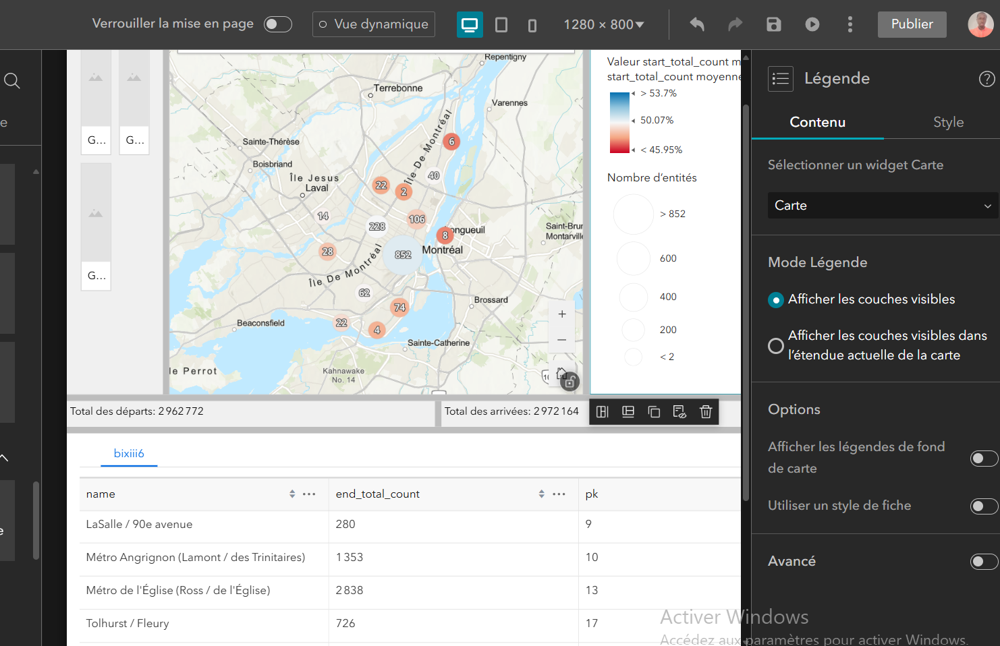
---

**6** Enregistrer et publier

---

---

## Étape 6: Mise à jour des données avec FME


**1** Dans le même FME, ajout d'un `CSV READER`:
```bash
https://sitewebbixi.s3.amazonaws.com/uploads/docs/20220108-donnees-ouvertes-816bd4.zip
```

Ensuite, On remplace la source de juillet par la source d'août en faisant un Clic-droit sur le Reader de juillet pour choisir l’option “Disable”.
---

---

---

---

**2** AGOL readere

Créer un nouveau Reader pour lire les données de ArcGIS Online du mois de Juillet pour faire la comparaison avec les nouvelles données du mois d'août.
---

---

**3** N’exposez que les 4 attributs ci-bas.

---

---

**4** ChangeDetector

nous permet d’intercepter tous les nouveaux changements entre les 2 mois de données. On choisit la clé primaire (identifiant unique) (pk) de station pour identifier les changements 

---

---

Entre juillet et août il y a 13 stations disparues et 51 nouvelles qui seront insérées et 722 stations qui seront mises à jour.
---

---

**5** On fait le menage avec `AttributeManager` puis on ajoute un `AGOL Writer`.
---
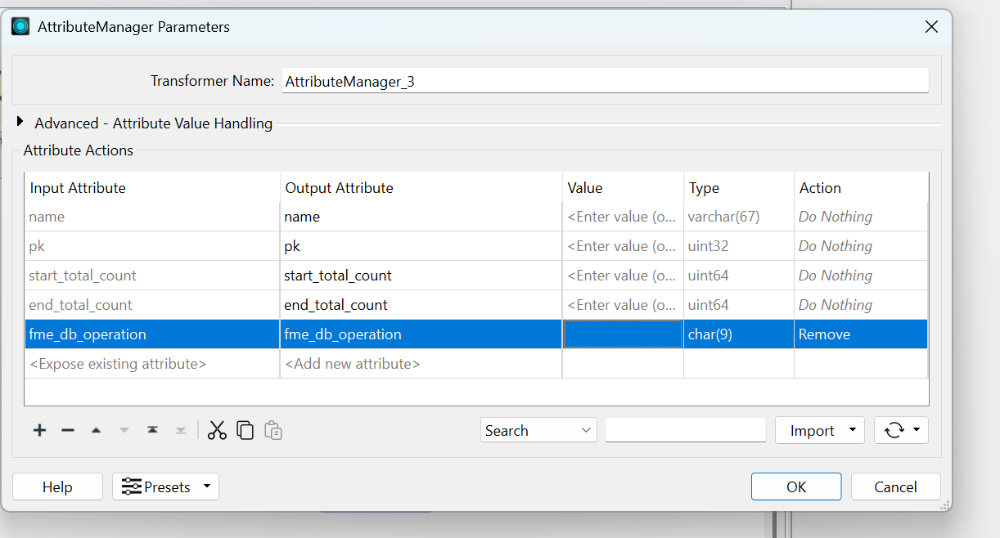
---

---

---
---

---

Le workbench final devrait ressembler à ce qui suit:

---

---

On peut maintenant faire une mise à jour de notre `Dashboard` ou `Expérience builder` et voir que les données ont été mises à jour sans rien briser (dû au fait qu’il y a 13 stations supprimés et 51 nouvelles stations ).
---

---


 


