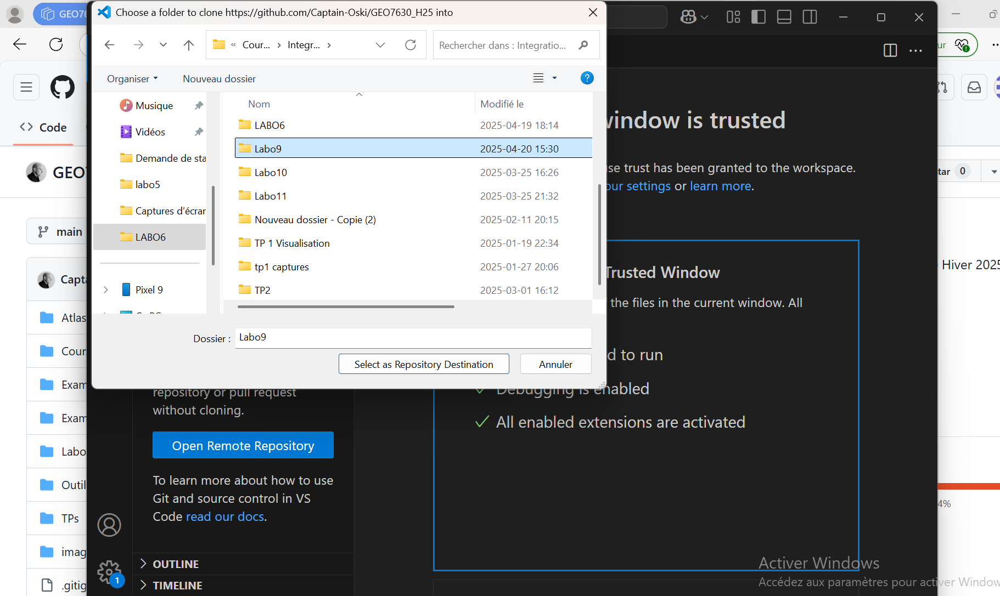
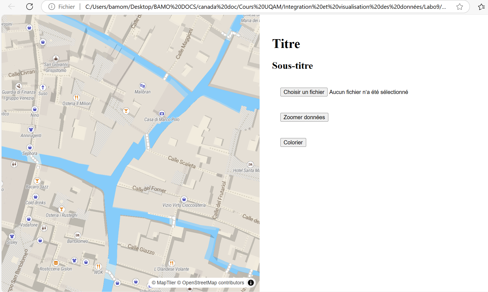

## Laboratoire 9 : Webmapping Open Source et interaction avec MapLibreGL

# Etape 1: Clonage du projet

**1** A l'aide de `Visual Studio` on va cloner le   repository GitHub:
```bash
git clone https://github.com/Captain-Oski/GEO7630_H25
```
---

---

---

**2** Ensuite on crée une branche personnelle pour nos modifications:
```bash
git checkout -b votre_nom-labo9
```
---

---

# Étape 2: Chargement de l'application

**1** Accéder au répertoire du laboratoire 9 puis Ouvrir le fichier index.html. On vérifie ensuite que l’application charge correctement.
---

---

---
# Étape 3: Modification du code

**1** Dans le fichier `lab9.js`, on va localiser et modifier les coordonnées et le niveau de zoom par défaut puis on sauvegarde. Ensuite, on recharge la page web pour voir apparaître nos modifications (F5).
---

---

---

**2** Ajout du GeoJSON: sur la carte avec le bouton `choisir un fichier`, on va ajouter le fichier geojson `garage`. Ensuite on peut voir apparaître les polygones sur la carte mais avec une symbologie par défaut.
---


---

---

# Étape 4: Modification de la couleur

**1** Modifier la couleur des polygones à l'aide de la fonction `colorPolygons()`: A la ligne 100  du fichier `lab9.js`,  On change la couleur `'red'` par `'#9f40ff'` (notation Hexadécimale des couleurs) puis on teste le résultat avec le bouton `Colorier` sur la  carte.

---

---

---

**2** Créer une fonction de couleur aléatoire: 
On va créer un nouveau fichier `randomColor.js` et insérer le code suivant :
```bash
function randomColor() {
  var r = Math.floor(Math.random() * 256);
  var g = Math.floor(Math.random() * 256);
  var b = Math.floor(Math.random() * 256);
  return "#" + ((1 << 24) + (r << 16) + (g << 8) + b).toString(16).slice(1);
}
```
---

---

Puis on l'ajoute dans le fichier lab9.html :
```bash
<script type='text/javascript' src='./randomColor.js'></script>
```

---

---

**3** Appliquer une couleur aléatoire aux polygones: dans lab9.js, à la ligne 100 dans la  fonction `colorPolygons()`, on va modifier la couleur par `randomColor()`. Ensuite on recharge la page et on test le résultat.

---

---

---

**4** Ajout d'une coloration thématique à l'aide de `operator_id` pour colorier des polygones en fonction de l’attribut `operator_id`. Ce type de paramètre sera  utilisé ici dans la propriété 


